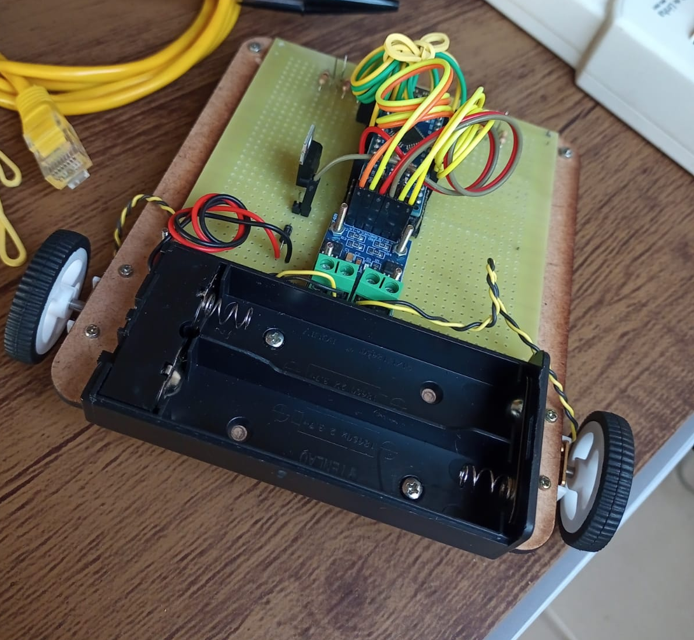
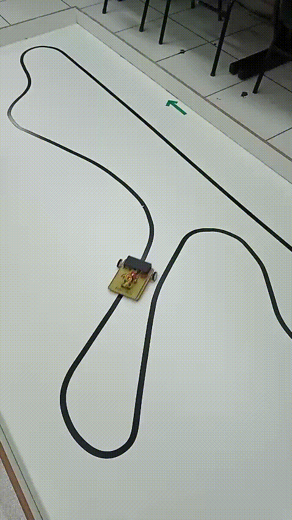

# Line follower robot

A repository of control algorithms for programable line-follower robots using different control strategies.

Digital proportional-integral-derivative (PID) controllers and their variations are implemented for 8-bits AVR microcontrollers such as the ATMega328P. Moreover, the repository is intended as a practical reference for learning, testing, and comparing different control approaches.

The following programs are available:
- [Line follower PID 2 sensors tustin](./line_follower_pid_2sensors_tustin)
- [Line follower PID 2 sensors tustin 2DOF](./line_follower_pid_2sensors_tustin_2dof)
- [Line follower PID 2 sensors tustin nonlinear](./line_follower_pid_2sensors_tustin_nonlinear)
- [Line follower PID 4 sensors tustin](./line_follower_pid_4sensors_tustin)
- [Line follower PID 4 sensors tustin 2DOF](./line_follower_pid_4sensors_tustin_2dof)
- [Line follower PID 4 sensors tustin nonlinear](./line_follower_pid_4sensors_tustin_nonlinear)

## Physical experiment

The physical experiment and its operation on a closed circuit is shown below.

    

    

## Notes

If this project helped you, please consider citing it properly and starring the repository. Future improvements and new features may be added in the future.